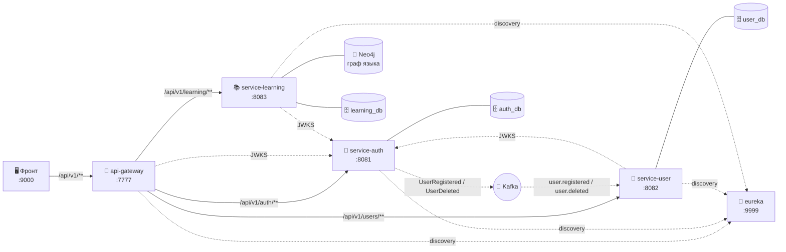
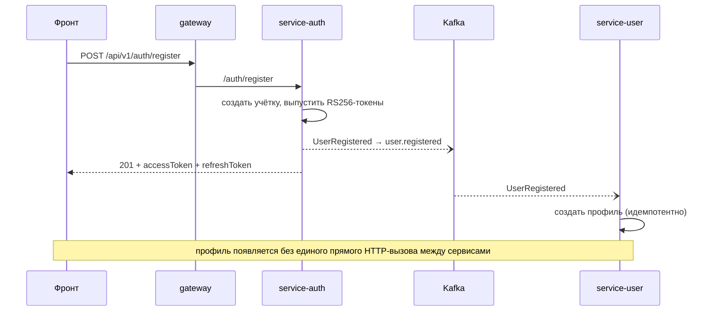

<div align="center">

# 🌱 Eunoia

### Knowledge Garden — ты не проходишь курс, ты выращиваешь свои знания

Бэкенд платформы, где обучение устроено как уход за садом: знания — это граф, который
живёт, ветвится и «увядает» без внимания, а не линейный список пройденных уроков.


-231F20?style=flat-square)

-2088FF?style=flat-square&logo=githubactions&logoColor=white)

</div>

---

## 🌿 Что это

Большинство обучалок — это лента уроков: прошёл юнит, получил галочку, забыл через неделю.
**Eunoia переворачивает модель.** Твои знания — это **живой граф**, за которым ты ухаживаешь:
слова связаны формами и смыслами, темы ветвятся, а то, что давно не повторял, постепенно
«увядает» и подсвечивается — как растение, которое пора полить.

Первая вертикаль — **изучение языков (английский)**. Дальше метафора и движок переносятся
на другие домены (программирование, математика, ...) — граф знаний универсален.

## ✨ Ключевые идеи

### 🧬 Два графа, которые нельзя смешивать
Это сердце продукта. Контент и прогресс живут раздельно:

- **Канонический граф знаний** — общий для всех. Узлы: слова, правила, понятия. Рёбра: связи
  вроде `go →[прошедшее]→ went`, `postpone ↔ delay` (синонимы), `word →[тема]→ ветка`.
  Один на всю платформу. Живёт в **Neo4j**.
- **Персональный оверлей мастерства** — у каждого свой. Не копия канона, а *наложение* сверху:
  какие узлы человек знает и насколько «свежо». Живёт в **Postgres**.

> Контент — отдельно, прогресс — отдельно. Смешивать нельзя: иначе граф знаний загрязняется
> личными данными, а прогресс нельзя переиспользовать между людьми.

### 🍂 Сад — это не картинка, это механика
«Увядание» — настоящий **FSRS** (интервальное повторение). У каждого известного узла есть
*retrievability* — вероятность вспомнить прямо сейчас; она падает со временем. Цвет листа =
эта вероятность. Сад буквально показывает, что забывается, до того как ты это забыл.

| Элемент сада | Что это в механике |
|---|---|
| 🍃 Лист | слово / понятие |
| 🎨 Цвет листа | retrievability (FSRS) — свежесть памяти, увядает со временем |
| 🌿 Ветка | тема |
| 🪵 Ствол | грамматика / структура |
| 🍎 Плод | достижение |
| 🧑‍🌾 Садовник (AI) | целится в конкретный пробел: что полить именно тебе именно сейчас |

### 🧑‍🌾 AI-садовник
Не «сгенерируй урок», а точечная помощь: смотрит на твой персональный граф, находит слабое/
увядающее место и предлагает, что подтянуть — с опорой на канонический граф связей.

## 🏛️ Архитектура

### Identity отдельно от профиля (Design B)
`service-auth` — единственный владелец **identity** (учётки, пароли, токены). `service-user`
хранит **только профиль** и получает `userId` из JWT. Никто, кроме auth, не пишет в identity.

### Связь сервисов — событиями через Kafka
Сервисы не дёргают друг друга по HTTP для доменных изменений — они обмениваются событиями.
Каскад замкнут в обе стороны: регистрация заводит профиль, удаление аккаунта — сносит его.



### Гексагональная архитектура, границы держит компилятор
Каждый сервис — три модуля с однонаправленными зависимостями:

| Модуль | Роль | Что внутри |
|---|---|---|
| `*-logic` | 🧠 ядро | домен + порты + use case'ы. **Без** Spring/JPA/web |
| `*-api` | 🔌 веб-адаптер | контроллеры (сгенерированы из OpenAPI-контракта), мапперы домен↔DTO |
| `*-app` | ⚙️ инфраструктура | JPA-адаптеры, Kafka, security, конфиг, точка входа Spring Boot |

Ядро не знает про фреймворк — его нельзя случайно «протащить» в домен, потому что модуль
`*-logic` физически не видит Spring. Адаптеры подключаются к портам в composition root (`*-app`).

### Остальное
- **Contract-first.** Контракты — OpenAPI, публикуются в GitHub Packages; по ним генерятся
  и клиент, и серверные интерфейсы. Бэк и фронт — на одном контракте.
- **RS256 + JWKS.** auth подписывает токены приватным ключом, публичный отдаёт по
  `/.well-known/jwks.json`; gateway и user только **валидируют** (сами не выпускают).
- **Учебное ядро — модулит, не микросервисы.** `service-learning` держит knowledge (граф Neo4j) +
  garden (прогресс Postgres) одним развёртыванием (tutor/AI дорастёт вехой M6) — граф, прогресс и AI
  тесно связаны, дробить на сервисы там незачем.

## 🧩 Сервисы

| Сервис | Что делает | Порт | Статус |
|---|---|---|---|
| `eureka-server` | Service discovery | 9999 | ✅ есть |
| `api-gateway` | Точка входа: CORS, JWT по JWKS, роутинг `/api/v1/**` | 7777 | ✅ работает |
| `service-auth` | Identity: учётки, RS256+JWKS, refresh/logout/локаут, email-флоу, удаление аккаунта | 8081 | ✅ M1/M2 |
| `service-user` | Профиль: событийное создание, аватар, настройки, публичный профиль | 8082 | ✅ M3 |
| `service-learning` (модулит) | Граф языка (Neo4j) + сад/прогресс (Postgres) + REST — **сам продукт** | 8083 | ✅ M4 |
| tutor (AI-садовник) | Точечная помощь по персональному графу | — | 🗓️ M6 |

## 🔄 Событийный каскад (пример: регистрация)



## 🛠️ Технологии
- **Java 25**, **Spring Boot 4.1**, **Spring Cloud 2025.1.2** (Oakwood)
- **PostgreSQL** — реляционные данные (identity, профиль, аватар в `bytea`)
- **Apache Kafka** — событийная связь сервисов
- **Neo4j** — граф языка (service-learning, ✅ M4); **WikDict/kaikki** — источники данных импорта
- **OpenAPI** (contract-first, генерация клиента/сервера), **Eureka** (discovery)
- **Тесты:** JUnit 5 + **Testcontainers** (Postgres/Kafka), покрытие — **JaCoCo**
- **CI:** GitHub Actions, **per-module** (гоняется только затронутый модуль)

## 🚀 Сборка и запуск

Сборка (нужен доступ к корпоративному Nexus):
```bash
mvn -fae -DskipTests install   # без тестов
mvn -fae install               # с тестами (нужен Docker: Testcontainers поднимает Postgres и Kafka)
```
> ⚠️ `mvn clean` не использовать — сносит сгенерённые из OpenAPI исходники в `auth-api`/`user-api`/`learning-api`.

Запуск локально:
```bash
# 1. Инфраструктура: Postgres (базы auth_db, user_db, learning_db) — сам;
#    Kafka + Neo4j (база neo4j) — через compose / Neo4j Desktop
docker compose up -d

# 2. Сервисы по порядку
#    eureka-server  →  service-auth  →  service-user  →  service-learning  →  api-gateway
```
Схему БД накатывает Liquibase на старте. Фронт ходит на gateway `http://localhost:7777/api/v1`
(dev-origin фронта — `http://localhost:9000`).

## ✅ Что уже работает
- **service-auth (M1/M2):** регистрация, вход, refresh с ротацией, logout, локаут после серии
  неудачных логинов, подтверждение email и сброс пароля (одноразовые токены), удаление аккаунта.
  Аудит событий в `auth_events`.
- **service-user (M3):** профиль **создаётся событием** из auth (без прямого HTTP); чтение/правка
  своего профиля и настроек (`/users/me`), публичный профиль (`GET /users/{id}`); **аватар** —
  загрузка файла (`POST /users/me/avatar`, хранение в Postgres `bytea`) и публичная отдача
  (`GET /users/{id}/avatar`).
- **service-learning (M4, модулит):** канонический граф языка в **Neo4j** (слова-леммы с частями речи,
  формы, переводы, синонимы/антонимы/гиперонимы, темы, грамматика, IPA) + персональный «сад» в
  **Postgres** (мастерство по лемме). REST: карточка слова (`/learning/words/{id}` — variants по частям
  речи), **блоки топ-слов** (`/learning/bands` — уровни по частоте с прогрессом), слова блока/темы,
  поиск, ствол грамматики, отметка «Знаю/Учить» + очередь `/learning/study`. Данные — реальный импорт
  (kaikki/Wiktionary + частотник + WikDict) офлайн-тулом `learning-ingest`.
- Всё под **100% покрытием** (юниты + интеграция на Testcontainers) и per-module CI.

## 🗺️ Roadmap
Живой план, архитектурные решения и статус милстоунов — в **[ROADMAP.md](ROADMAP.md)**.
**M4 (`service-learning`) закрыт** — тот самый продукт (граф языка + сад + REST, word-модель, блоки
топ-слов). Следующая веха — **M5: сад с FSRS** («увядание» вместо статуса, планировщик повторений).
